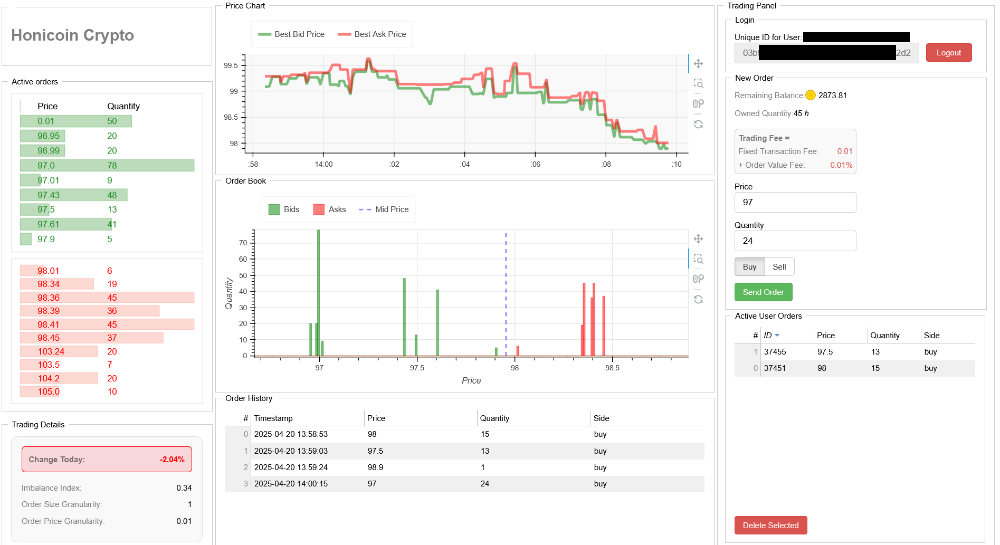
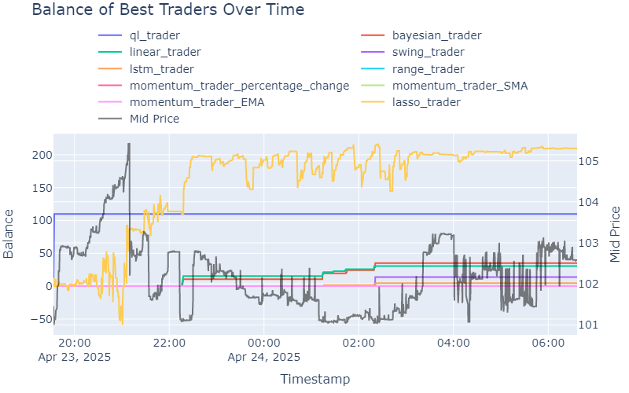

# Exchange Simulator for the Limit Order-Driven Market

This project is a **modular and extensible exchange simulation platform** designed for studying and evaluating trading strategies within a realistic limit order book (LOB) market environment. It bridges the gap between academic research and practical trading applications.



## 🔍 Project Overview

- Simulates a realistic limit order-driven stock exchange.
- Enables the integration of both manual and autonomous trading agents.
- Compatible with a wide variety of algorithmic and machine learning-based strategies.
- Includes manipulators to study market vulnerabilities.
- Provides tooling for analyzing simulations and **visual comparison** of trading strategy performance.

## 🧠 Research Objectives

- Analyze and simulate market microstructure dynamics.
- Evaluate the performance and stability of trading algorithms.
- Serve as a bridge between theoretical research and real-world application.
- Study market dynamics and the impact of strategic behaviors on liquidity, stability, and fairness.
- Use the platform for educational, regulatory, and experimental purposes.

## 💻 Key Features

- Modular simulation framework with realistic LOB mechanics.
- Autonomous agent support including ML-powered strategies.
- Fraudulent agent simulation for stress-testing market resilience.
- Web interface powered by **Tornado + Bokeh** for real-time monitoring.
- Analysis tools using **Jupyter Notebooks** for report generation and visualization.

## 🧪 Technologies Used

- **Python 3.9 +**
- **Tornado** (web server)
- **Bokeh** (web-based visualization)
- **NumPy**, **Pandas** (data handling)
- **Jupyter** (result analysis and reporting)

## 🚀 Getting Started

### 📦 Clone the Repository
```bash
git clone https://github.com/Jivl00/Exchange_simulator_for_the_limit_order-driven_market
cd Exchange_simulator_for_the_limit_order-driven_market
```

### 📥 Install Dependencies
```bash
pip install -r requirements.txt
```

### 🔧 Configuration
Edit `config/server_config.json` to adjust: server IP, ports, and API paths.

### 🟢 Start the Server
```bash
cd src
python server/server.py
```
Once the server is running, start the market simulation components:

```bash
python server/agents/market_maker.py
python server/agents/liquidity_generator.py
```

To resume from a previous state:
```bash
python server/server.py -l
```
- Simulations are saved to `data/` for post-processing after server shutdown.

### 👥 Run Market Agents
Agents are defined in `client/agents`. Start one like this (from the `src` directory):
```bash
python client/agents/your_agent.py
```

### 🌐 Launch Web Interface
```bash
python viz/main_page.py
```
Access the GUI at `http://<IP_ADDRESS>:<VIZ_PORT>` as configured.

### 📊 Analyze Results
Open the reporting notebook:
```
viz/report/report.ipynb
```
Use it to:
- Compare strategy performance
- Analyze trade volume/frequency
- Summarize outcomes statistically



### ✅ Run Tests
```bash
cd tests
python -m unittest tests.py
```

### 📝 Documentation
- For more information on the web interface and algorithmic trading, refer to the [trading maual](docs/Trading_manual.pdf).
- Official thesis document detailing the design, implementation, and evaluation of the exchange simulator: [Thesis](docs/dp_2024_25_KIMLOVÁ_Vladimíra.pdf).